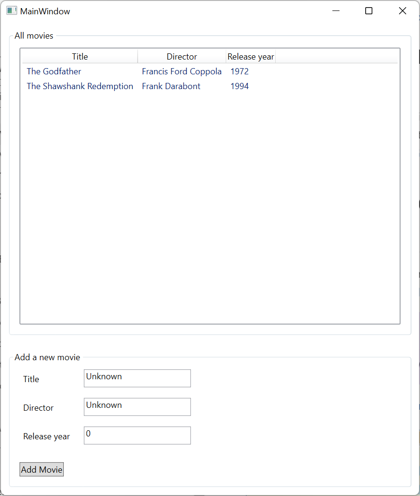
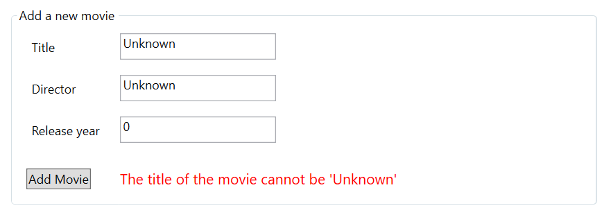
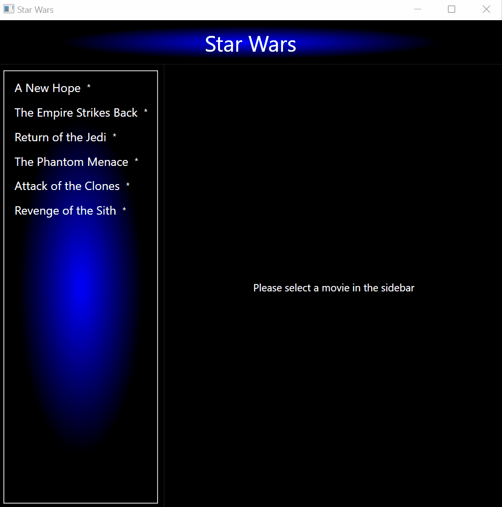

# Exercises - Chapter 3 + 4 - WPF Databinding, MVVM, Resources, Data Templates

## Exercise 1 (Databinding)
In this exercise you will create a window that shows a list of movies and also a form to add a new movie to the list. 

Het overzicht van movies moet getoond worden met een *ListView* met 3 kolommen: 
* Een kolom met als hoofding **Title**. De breedte van deze kolom past zich aan de inhoud aan.
* Een kolom met als hoofding **Director**. De breedte van deze kolom past zich aan de inhoud aan.
* Een kolom met als hoofding **Release year**. De breedte van deze kolom past zich aan de inhoud aan.

Leest eerst iets meer over de *GridView* in een *ListView*. Bijvoorbeeld op https://learn.microsoft.com/en-us/dotnet/desktop/wpf/controls/gridview-overview .

De rijen in de *ListView* worden gekoppeld aan een collectie van *Movie* objecten. 
De initiële movies worden in de codebehind geladen. Maak hierbij gebruik van de *GetDummyMovies* methode. 
Zorg ervoor met behulp van databinding dat de juiste waarden in de rijen getoon worden. 

Om een nieuwe movie aan te maken, maak je ook gebruik van databinding. Hierbij koppel je de invulvelden aan een achterliggend *Movie* object. 
Na het klikken op de knop wordt de ingevulde movie toegevoegd aan de *ListView*. Dit moet automatisch gebeuren als je de collectie van movies die aan de *ListView* gebonden is, wijzigt. 
Na het toevoegen van een movie moet het ook mogelijk zijn om een volgende movie toe te voegen.

Als er geen title, director of release year > 0 is ingevuld, dan wordt een foutboodschap weergegeven in de daarvoor voorziene *TextBlock*. 
Na het succesvol toevoegen van een movie, wordt een eventuele (vorige) foutboodschap terug gewist.

## Exercise 2 (Star Wars)
In this exercise you will create a window that shows the 6 classic Star Wars movies.
When a movie is selected, the title and opening crawl of the movie is shown. 
A rating from 1 star to 5 stars can be given to each movie. A rating can be given by using the slider or by clicking on the button to immediately give a 5 star rating. 
The 5 star rating button should only be enabled when a movie is selected and that movie does not have a 5 star rating yet.
The rating of each movie is also shown in the sidebar on the left.

### Implementation details
* The MVVM pattern is used in this exercise
* Font brushes, background brushes and converers should be retrieved from the application resources
* To make the exercise more testable, interfaces are used for the ViewModels. Concrete instances of the ViewModels are created in App.xaml.cs and injected into the MainWindow.
* Don't start this exercise without studying the theory first!
* Use the feedback from the tests as a guide.