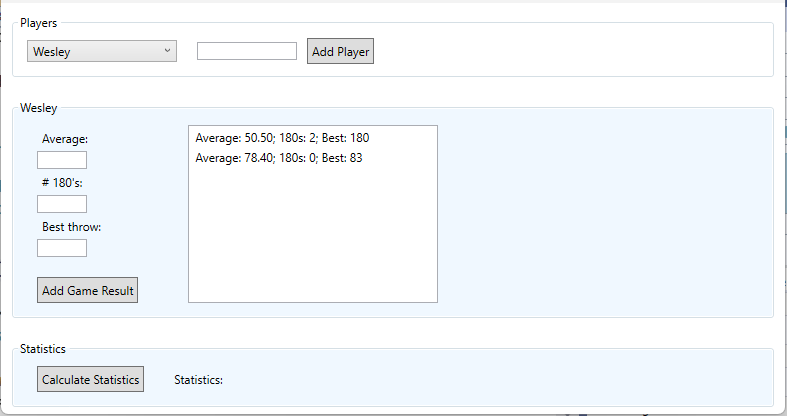
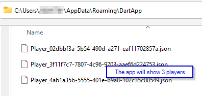
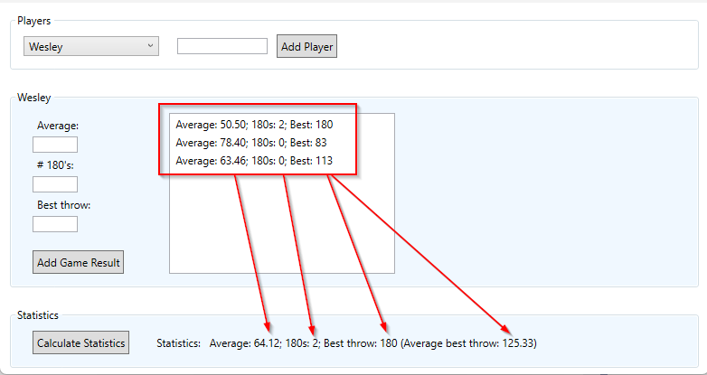

# Exercises - Chapter 6 - Layered Architecture

## Exercise 1 (DartApp)
In this exercise you will be creating a desktop application 
that can be used to collect data for players of a dart game. 

The user can add players to the application. Each player has a collection of game results. The application is also able to calculate some statistics.

The user can add a player by filling in the name of the player in the textbox and clicking on the *Add Player* button.

To add game results to a player or calculate statistics, you can select a player in the dropdownlist. 

When a player is selected, the list of games that were added is shown. 
It is possible to add a new game result by filling in the textboxes and clicking on the 'Add Game Result' button. 
 A game results contains: 
* The average throw score in the game (double)
* The number of 180's (the top score with 3 darts) thrown (integer)
* The highest throw in the game (integer)

The players and their scores are stored in the *AppData* folder of the file system. 
Each player is stored in a json format in its own file. In  the screenshot below there are three files so three players should show up in the application: 

The starting repository already contains some logic to create and store these files!

The solution should be organized in a **proper layered structure**. 

### Domain
Start with the domain layer. This layer already exposes some public interfaces (see Contracts: *IPlayer*, *IPlayerStats* and *IGameResult*). 
You must create the concrete implementations. 

The concrete implementations of these interfaces should be hidden from the other layers.

The concrete *IPlayerStats* implementation will be used to store the calculated values of the player statistics. A player has a list of *GameResults*. Use this list to calculate the overall average (*tip*: this is the average of all the averages), the maximum score thrown in any game, the average of all the highest scores, and the total of 180s thrown in all the games played by this player.

Use the automated tests to guide you in the right direction.

### AppLogic
The application logic layer defines an interface for storing and retrieving players (*IPlayerRepository*). The concrete implementation of this interface should be located elsewhere.

There is also a *IPlayerService* that should get a concrete implementation in this layer. 

### Infrastructure
Implement the infrastructure layer. Here you will provide a concrete implementation for *IPlayerRepository*. 
The concrete repository will store the players and their data as files in the *AppData* folder.

Use the automated tests to guide you in the right direction.

### Presentation (UI)
When the infrastructure layer is in place, implement the presentation (UI) layer.

The XAML code is already given.

Use the automated tests to guide you in the right direction.
