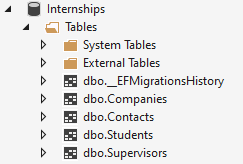
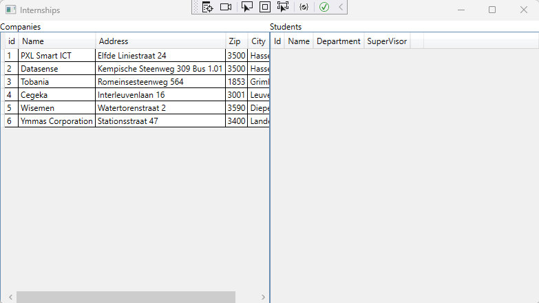

# Exercises - Chapter 8 - Entity Framework

## Exercise 1 (InternshipsAdmin)
In this exercise you will be creating a desktop application ro administer internships. 

First you have to create a database by using Entity Framework. The name of the database has to be Internships and has to contain the folowing tables:

You have to seed 2 companies:

You can add student, contact and supervisor data manually.

When the application starts, you get a list of all the internship companies

When you select a company, the students whose supservisor is connected to the company, will be shown on the right.

Also 2 comboxes will be visible. The students combobox contains all the students who doesn't have a supervisor yet.
The supervisor combobox contains all the supervisors of the selected company.
By clicking the 'Add Student with Supervisor to Selected Company' will add the selected Supervisor to the selected company, and add the selected student to the selected supervisor.
When the button is clicked, the selected student will be removed from the combobox (because he will no longer be a student without a supervisor).

When a student is added in the list on the right, this student can be removed by clikcing the 'Remove Student' button. When the student is removed from the list, the student will
again be visible in de combobox (he will be a student without a supervisor again).

### Domain

The domain layer is complete. You do not have the change or add code in this layer. 

### AppLogic
The AppLogig layer is complete. You do not have the change or add code in this layer. 

### Infrastructure
Implement the infrastructure layer. 
Create the data model by adding the correct code to the Contextfile. Make sure EF interpretes this model correctly so it can create the Internships database like the screenshot above.
The database has to created under the (localdb)\mssqllocaldb SQL Server instance.

Also provide seeding data.

In this layer also provide a concrete implementation for ICompanyRepository and IStudentRepository. The concrete repositories will store the data in the Internships database.

Use the automated tests to guide you in the right direction.

### Presentation (UI)
When the infrastructure layer is in place, implement the presentation (UI) layer.

The XAML code is already given.

Use the automated tests to guide you in the right direction.
